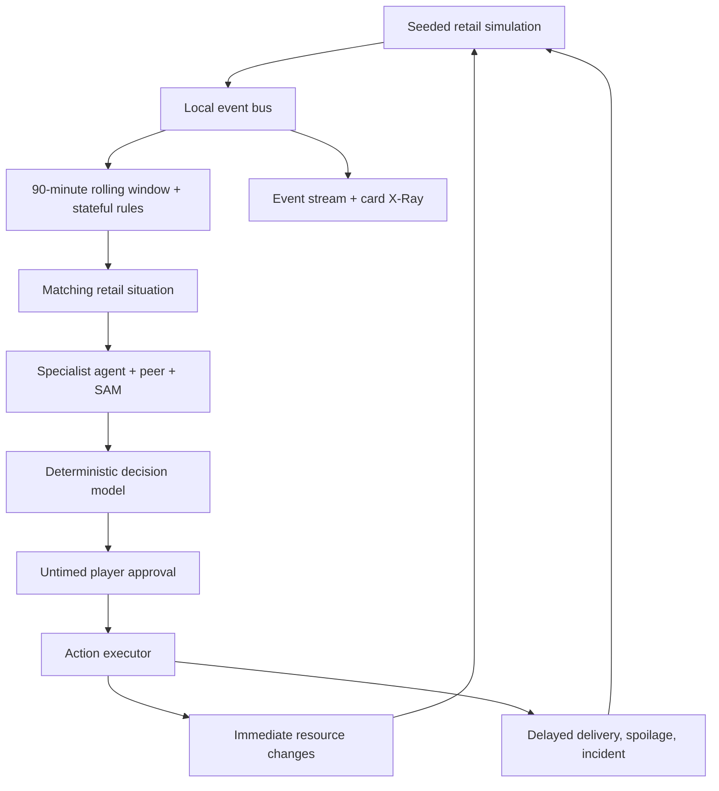

# Architecture

## Simulation and selection

`RetailGame` owns an isolated state and seeded PRNG. The state tracks resource health, demand, queues, staff, supplier delay, promotion duration, freshness, equipment reliability, margin, customer loyalty, forecast volatility, pending consequences, and decision history. Resources start at 60 and are bounded to [0, 100]. A resource reaching zero ends the shift.

One operational interval advances between decisions, rather than depending on render frame rate. The sixth decision gets extra demand and checkout pressure, shaped by prior choices. Delayed actions use absolute decision steps, so an order placed on day one can arrive on day two. Supplier orders, incidents, and spoilage retain their originating action event as `causationId`.

Correlation only considers business events from the preceding 90 simulated store minutes. A family activates only when its store-state conditions and required events exist. The engine then filters the 60 situation variants by day and pressure threshold, discourages repetition over the last six choices, preserves critical-resource priority, and performs a seeded weighted shuffle among eligible candidates near the highest priority. It does not select a disconnected card and manufacture events to justify it.

The engine records the exact evidence and rule in each proposal. X-Ray reads that record directly. A single optional mid-card telemetry update occurs after six seconds of active viewing. It can update the recommendation when demand or checkout pressure changes; it never commits a choice. Untimed play, pause, and information panels allow unlimited deliberation.

Reproduction requires the same seed, mode, choices, delegation settings, and whether the mid-card telemetry pulse occurred on each card. Current simulated state and the sequence of events determine consequences. The engine tests replay exactly matching action traces.

## Agent boundaries

SAM coordinates; STOCKY prioritizes stock, PENNY liquidity and margin, SHIELD losses and resilience, and SPARK reputation and demand. Opinions are concise authored dialogue. GPT, Claude, and Gemini labels are illustrative demo settings. There is no LLM inference in this build.

Autonomy is opt-in. Day two unlocks one small stock top-up per day: inventory +6, cash −3, only with inventory below 35 and cash above 28. Day three adds one security alert that reduces fraud pressure without spending. Day four adds one pause of an active campaign when inventory is low. Six daily strategic decisions remain human-controlled.

## UI and storage

React + TypeScript + Vite + Tailwind CSS + Motion + Lucide. The main surface is one card with four resource meters and two buttons; optional shop, events and architecture panels use native modal dialogs. Keyboard controls and reduced-motion preferences are supported. Only personal best scores are persisted to local storage. Shared links encode seed and mode, never credentials or a claim to a trusted global leaderboard.

Full and quick scores have separate local records and normalized completion weights. Currency shown in reports is synthetic business telemetry, not a real accounting ledger.
